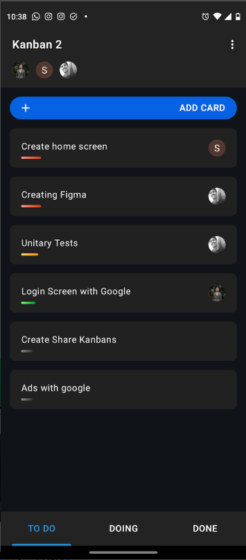
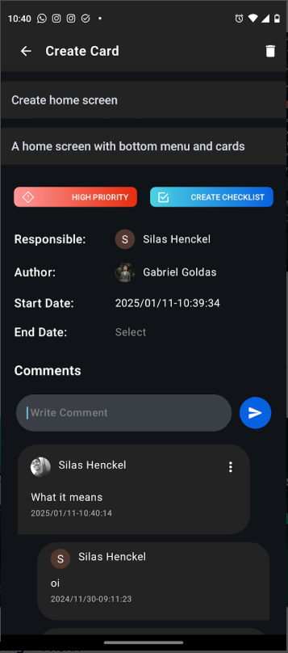
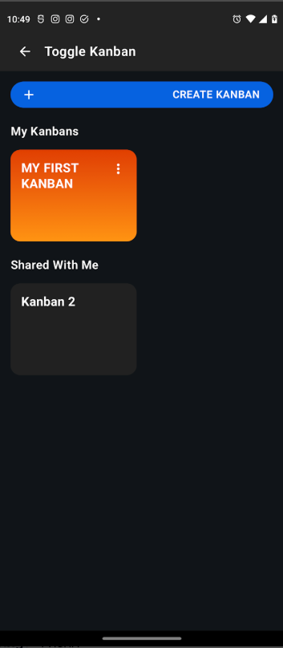
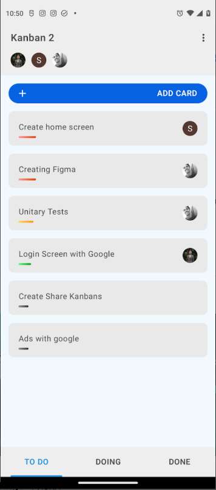

# Simple Kanban

This app was developed with the intention of being a simple and useful mobile Kanban board to streamline small projects.

In this project, I was able to put into practice my knowledge of some of the most modern resources in Android development, such as Kotlin, Jetpack Compose, Dependency Injection with Hilt, MVVM Architecture, ROOM Database, Firebase Firestore database, and Social Authentication with Google.

## Screenshot

  
  
  
  

## Download

Download the app on Google Play:

https://play.google.com/store/apps/details?id=com.sg.simplekanban&hl=pt_BR

## Overview

The application enables users to create, update, and organize tasks across different stages of a Kanban workflow such as:

- To Do
- In Progress
- Done

The project was built to demonstrate modern Android architecture using Kotlin and Jetpack Compose while following clean architecture principles and best practices for scalability and maintainability.

---

## Architecture

The project follows **Clean Architecture combined with MVVM** to ensure separation of concerns and testability.

Architecture layers:

UI Layer  
Handles UI rendering and user interaction using Compose.

Domain Layer  
Contains business logic and use cases independent from Android framework.

Data Layer  
Responsible for data retrieval from local or remote sources.

Data flow:

UI → ViewModel → UseCase → Repository → DataSource

Benefits of this architecture:

- Separation of concerns
- High testability
- Scalability
- Easier maintenance

---

## Tech Stack

Main technologies used in this project:

- Kotlin
- Jetpack Compose
- Android ViewModel
- Kotlin Coroutines
- StateFlow
- Dependency Injection with Hilt
- Local persistence with Room
- Firebase Authentication
- Firebase Firestore

Android libraries used include components from **Android Jetpack**, such as:

- Lifecycle
- Navigation
- ViewModel

---

## Project Structure
app/
├── data
│ ├── repository
│ ├── datasource
│ └── model
│
├── domain
│ ├── model
│ ├── repository
│ └── usecase
│
├── presentation
│ ├── screens
│ ├── components
│ └── viewmodel

Explanation:

data  
Contains repositories and data sources responsible for interacting with Firebase and local database.

domain  
Contains business rules and use cases independent of frameworks.

ui  
Contains composables, screens and ViewModels responsible for UI state.

---

## State Management

UI state is managed using **StateFlow** and collected inside Compose screens.

This ensures a reactive and lifecycle-aware UI.

Example:

---

## Asynchronous Programming

The project uses **Kotlin Coroutines** for asynchronous operations.

Repositories expose suspend functions and ViewModels launch coroutines using viewModelScope.

---

## Code Quality

The project follows best practices such as:

- Separation of concerns
- Dependency injection
- Reactive UI state
- Modular architecture

Static analysis and lint checks can be integrated using tools such as:

- ktlint
- detekt
- Android Lint

---

## Continuous Integration

The project can be integrated with CI pipelines using tools such as **GitHub Actions** to automate:

- lint checks
- unit tests
- build verification

---

## Architecture Diagram

UI (Compose)
↓
ViewModel
↓
UseCases
↓
Repository
↓
DataSource (Firebase / Room)

